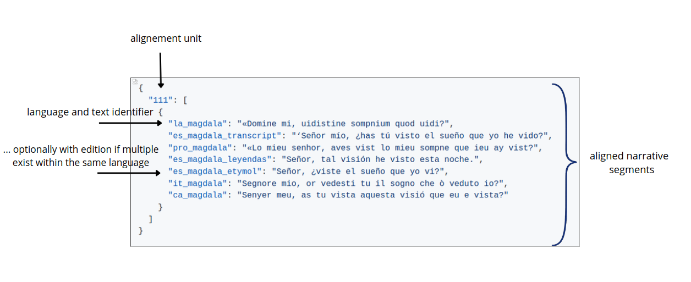

# Data Structure

This document describes the JSON structure used for the medieval prose alignment files in the **Parallelium multilingual alignment dataset**.

The medieval prose files are organized by work and by alignment unit. Each alignment unit groups the available textual versions corresponding to the same semantic narrative segment.

## General Format

Each JSON file generally contains three main fields:

- `work`: title of the work or textual tradition
- `mode`: preparation or alignment status
- `alignement_id`: dictionary of aligned narrative units

Inside `alignement_id`:

- each key corresponds to an alignment unit ID
- each value contains a list of aligned segment groups
- each segment group maps version identifiers to text segments

Each alignment unit contains a list. In the current medieval prose files, this list generally contains one dictionary.

That dictionary maps version identifiers to the corresponding text segment.

A simplified example has the following structure:

```json
{
  "work": "example_work",
  "mode": "edited_for_manual_alignment",
  "alignement_id": {
    "unit_001": [
      {
        "fr_example": "Example French segment.",
        "en_example": "Example English segment."
      }
    ]
  }
}
```

<p align="center">
  
</p>

## Alignment Units

Alignment unit IDs are dataset-level identifiers used to group corresponding textual material.

They may be simple numeric identifiers, ranges, or composite identifiers, for example:

```text
001
002-003
0027_0028b
```

These identifiers do not necessarily correspond directly to manuscript divisions, printed edition divisions, sentence numbers, or paragraph numbers.

## Version Identifiers and Language Codes

The keys inside each alignment unit are version identifiers.

Each version identifier must begin with a language code or language prefix. This prefix allows the processing pipeline to identify the language of each segment consistently.

In these identifiers:

- the first element indicates the language or historical language variety;
- the remaining elements identify the textual version, manuscript family, edition, or source label.

Language prefixes follow contemporary ISO language codes whenever possible. When no specific ISO code is used for a medieval stage of a language, or when a historical variety is treated through its closest modern equivalent, the code of the closest corresponding modern language is used.

For example:

- Galician-Portuguese is encoded with `pt`.
- Navarro-Aragonese is encoded with `an`.

Some historical or mixed-language labels may use project-specific prefixes when a single modern language code is not sufficient. For example, `fro_it` is used for the Franco-Italian hybrid literary language.

The remaining part of the identifier provides information about the textual version, manuscript family, edition, or source label.

Examples:

```text
pt_print_1502
es_salamanca
fr_tresor
la_Z
vec_VA
fro_it_F
```

Users should therefore treat these keys as **version identifiers with mandatory language prefixes**, not as simple language codes.

## Example

The following example shows an alignment unit from a medieval prose file:

```json
{
  "002-003": [
    {
      "fr_tresor": "Quant Troie fu prise et mise a feu et a ruines, et ke l'en ocioit les uns et les autres",
      "an_tresor": "Quando troya fue presa e mesa fuego e destroyda e que la ora matauan los vnos alos otros",
      "ca_tresor": "Quant Troya fon presa e cremada, e ulesa a ruïna, e hom ocejia los uns e los altres"
    }
  ]
}
```

In this example:

- `002-003` is the alignment unit ID.
- `fr_tresor`, `an_tresor`, and `ca_tresor` are version identifiers.
- Each value is the text segment corresponding to that alignment unit in a given version.
- The prefixes `fr`, `an`, and `ca` allow the processing pipeline to identify the language of each segment.

## Notes

Field names and internal structures may vary slightly depending on the corpus file.

Users should inspect individual files before running large-scale processing, especially when working across several works or version sets.
